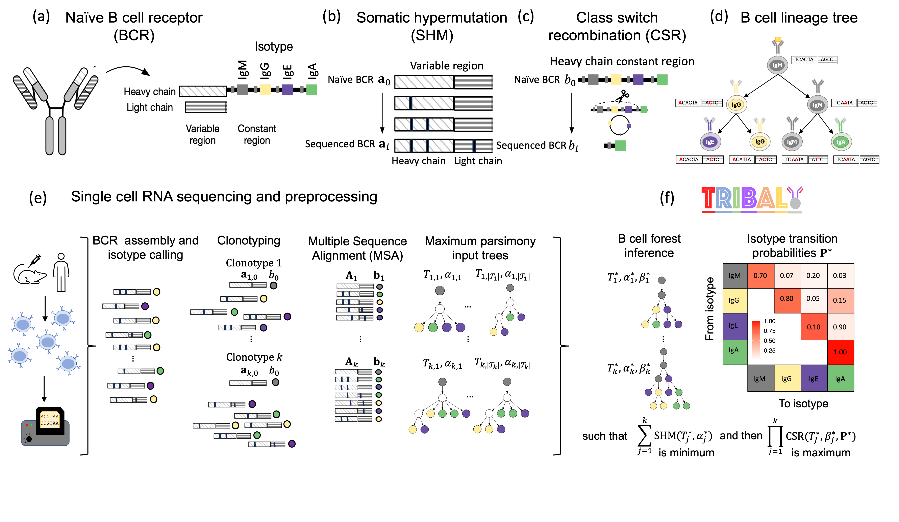

# TRIBAL: Tree inference of B cell clonal lineages 




TRIBAL (TRee Inference of B cell clonAl Lineages) is a method to infer B cell lineage trees from single-cell RNA sequencing data. TRIBAL trees jointly model the evolutionary 
processes of somatic hypermutation and class switch recombination. 

The input to TRIBAL is a multiple sequence alignment for each of the predetermined clonotypes aligned to the germline sequence and the isotype of each sequenced B cell. 
The output is forest of B cell lineage trees, one for each clonotype, with nodes labeled by BCR sequences (concatenated heavy and light chain) and the isotype of each B cell, as well as an isotype transition probability matrix. 


For help and questions please contact the [El-Kebir Lab](mailto:melkebir@illinois.eu).

For additional usage instructions and the API, see [https://elkebir-group.github.io/TRIBAL/](https://elkebir-group.github.io/TRIBAL/.)

# Contents
- [Installation](#installation)
  - [Using bioconda](#installing-from-bioconda)
  - [Using github](#installing-from-github)
- [Input data](#input-data)
  - [Sequencing data](#sequencing-data)
  - [Germline roots](#germline-clonotype-roots)
- [Usage](#usage)
 - [Package overview](#pacage-overview)
 - [Command line inferface](#command-line-interface)
- [Author](#authors)
- [Citing](#citing)
- [License](#license)


# Installation 
`tribal` can be installed via `bioconda` (recommended) or `github` and can be run as a [python package](#package-overview) or via the [command line](#command-line-interface). 


## Dependencies
`tribal` has the following dependencies:
```
    python>=3.9
    numpy>=1.26,<2.0
    networkx>=3.1
    ete3>=3.1.2
    glpk>=5.0
    pyomo>=6.7.3
    pygraphviz>=1.10
    pandas>=2.1.1
    biopython>=1.81
    mafft>=7.526
    phylip>=3.697 (included with package)
```

`tribal` can be installed from [Github](#installing-from-github) or from [bioconda](#installing-from-bioconda).  We recommend installing from [bioconda](#installing-from-bioconda).

### Installing from bioconda

```bash
conda create -n tribal -c bioconda tribal
conda activate tribal
```
See [Veryifing installation](#verifying-installation) to make sure the package was installed correctly. 

### Installing from GitHub
```
git clone https://github.com/elkebir-group/TRIBAL.git
cd TRIBAL

```

Dependencies can be installed using a package mangager such as `conda`, `mamba` or `micromamba`, using the included `tribal.yml` file.


```bash
conda env create -f tribal.yml 
```

To build and install `tribal` into this environment, follow the instructions below:

```bash
conda activate tribal
python -m build 
pip install dist/tribal-0.1.0-py3-none-any.whl 

```

`dnapars` is a requirement to run the preprocessing tools. The source code is included in the package and can be installed using the `dnapars_install.sh` script. 

```bash
chmod +x dnapars_install.sh
./dnapars_install.sh

```

### Verifying installation


`tribal` can be imported as a package or run via a command line interface.  

To verify the package can be imported,  run the following in the terminal.

```bash
python -c "import tribal"
```


To verify the CLI tool was properly installed, run the following in the terminal. 

```bash
tribal --help
```


# Input Data

`tribal` requires the input data to be first clustered into clonotypes, i.e., groups of cells that descend from the same naive B cell receptor.  We recommend [Dandelion](https://sc-dandelion.readthedocs.io/en/latest/) to assist with this preprocessing step. 

`tribal` requires two input files for preprocessing. The  [single-cell RNA sequencing data](#sequencing-data) and the [germline root sequences](#germline-clonotype-roots). 

## Sequencing data

Sequencing data should be provided in a csv file with the following columns:   

| Column Name         | Type     | Description | Required |
| :------------------ | :------: | :---- | :------:|
| cellid              |  str or int | unqiue id or barcode of the sequnced B cell  | True |
| clonotype           |   str       | unique clonotype id to which that cell belongs | True |
| heavy_chain_isotype   |  str   | the isotype of the constant region of the heavy chain  | True |
| heavy_chain_seq |  str   |the variable region sequence of the heavy chain | True |
|heavy_chain_allele | str | the v allele of the heavy chain | True |
| heavy_chain_isotype   |  str   | the isotype of the constant region of the heavy chain  | True |
| light_chain_seq |  str   |the variable region sequence of the light chain | False |
|light_chain_allele | str | the v allele of the light chain | False, if light_chain_seq not provided |

See [data.csv](example/data.csv) for an example file. 

## Germline clonotype roots

Additionally, the germline root sequences by clonotype should be provided in a csv file containing the heavy chain sequence and optionally, the light chain sequence. 

| Column Name         | Type     | Description | Required |
| :------------------ | :------: | :---- | :------:|
| clonotype           |   str       | unique clonotype id of the germline root (naive BCR) | True |
| heavy_chain_root  |  str   | the heavy chain variable region germline root sequence  | True |
| light_chain_root  |  str   | the light chain variable region germline root sequence  | False |


**note:**
    All light chain columns may be omitted if the `use_light_chain` argument in `preprocess` is `False`.  In other words, `tribal` may be used with only the heavy chain BCR sequences.

See [roots.csv](example/roots.csv) for an example file. 


# Usage

 `tribal` can be imported as a [package](#package-overview) into a python script or jupyter notebookd or it can be used as a [command line tool](#command-line-interface).

## Package overview

The following functions and classes are accessible via the `tribal` package:  

| Name               | Description | Type |  
| ------------------ |------|---- |  
| [preprocess](https://elkebir-group.github.io/TRIBAL/api/preprocess/#tribal.preprocess) | preprocess the input data to the correct format for tribal by finding a multiple sequence aligment and parsimony forest for each clonotype | function |
| [BaseTree](https://elkebir-group.github.io/TRIBAL/api/base_tree/) | a class to model the lineage tree topology | class |
| [Clonotype](https://elkebir-group.github.io/TRIBAL/api/clonotype/)| a dataclass to structure the input data for `tribal`| class |
| [Tribal](https://elkebir-group.github.io/TRIBAL/api/tribal/) | the main class to run the `tribal` algorithm and fit the input data |  class |
| [LineageTree](https://elkebir-group.github.io/TRIBAL/api/lineagetree/) | a class to model an inferred B cell lineage tree| class |
| [LineageTreeList](https://elkebir-group.github.io/TRIBAL/api/lineagetreelist/) | an extensions of class list to contain a list of B cell lineage trees | class |

The API provides additional details on each of these items. 

## Example data
In addition to the above functions and class, the following example data can be imported to help users better understand the data formatting and package use. 

| Name | Description | Type |
|------|-------------|------|
| df   | input sequencing data | `pandas.DataFrame` |
| roots | input germline roots for sequencing data | `pandas.DataFrame` |
| probabilities | example isotype transition probability matrix |`numpy.ndarray` | 
| clonotypes | dictionary of [Clonotype](https://elkebir-group.github.io/TRIBAL/api/clonotype/) objects | `dict` |
| lineage_tree | an example inferred [B cell lineage tree](https://elkebir-group.github.io/TRIBAL/api/lineagetree/)| [LineageTree](https://elkebir-group.github.io/TRIBAL/api/lineagetree/) | 
| lineage_tree_list | an example inferred [B cell lineage tree list](https://elkebir-group.github.io/TRIBAL/api/lineagetree/)| [LineageTreeList](https://elkebir-group.github.io/TRIBAL/api/lineagetree/) | 
 

Load and view the example input data:

```python
from tribal import df, roots

print(df.head())
print(roots.head())

```

Load and view the example output data from `preprocess`:

```python
from tribal import clonotypes
for key, clonotype in clonptypes:
    print(key)
    print(clonotype)
```

Load and view the example output data from the `tribal` algorithm:

```python
from tribal import probabilities, lineage_tree, lineage_tree_list
print(probabilities)
print(lineage_tree)
print(lineage_tree_list)
```


## Using the package

Here is a brief walkthrough of how to utilize the functionality of the `tribal` package.
First, load the package:

```python
import tribal

```

or, alternatively load specific functions, classes or example data.

```python
from tribal import preprocess, df, roots

```


### Preprocessing

The [preprocess](https://elkebir-group.github.io/TRIBAL/api/preprocess/) function will:  
    -  filter out clonotypes that are below the minimum number of cells .
    -  filter out cells which have v alleles that differ from the majority of the clonotype  
    -  perform a multiple sequence alignment (MSA) for each valid clonotype using [mafft](https://mafft.cbrc.jp/alignment/software/)  
    -  infer a parsimony forest for each clonotype given the MSA using [dnapars](https://phylipweb.github.io/phylip/)  


See [preprocess](https://elkebir-group.github.io/TRIBAL/api/preprocess/) for more details. 


```python
    from tribal import preprocess, df, roots
    isotypes = ['IGHM', 'IGHG3', 'IGHG1', 'IGHA1','IGHG2','IGHG4','IGHE','IGHA2']
    clonotypes, df_filt = preprocess(df, roots,isotypes=isotypes, 
                                    min_size=4, use_light_chain=True, 
                                    cores=3, verbose=True)
```

The output dictionary `clonotypes` is the formatted input to `tribal`.  To view
the formatted example data without running the preprocessing step, run the following.

```python
from tribal import clonotypes
for key, clonotype in clonotypes:
    print(clonotype)
```


### Running TRIBAL

Tribal takes the dictionary of [Clonotype](https://elkebir-group.github.io/TRIBAL/api/clonotype/) objects as input and can be run in two modes.   
1. `refinement` (recommended) : the full algorithm where the CSR likelihood is optimized by solving the most parsimonious tree refinement problem.  
2. `score` : the input parsimony lineage trees are not refined and isotypes of the internal nodes are inferred using weighted parsimony via the Sankoff algorithm, with the isotype transition probabilities as weights.   

```python
from tribal import Tribal, clonotypes

#the clonotype data contains the following isotypes encoded from 0 to 7
isotypes = ['IGHM', 'IGHG3', 'IGHG1', 'IGHA1','IGHG2','IGHG4','IGHE','IGHA2']
tr = Tribal(n_isotypes=len(isotypes), restarts=2, niter=15, verbose=True)
        
#run in refinement mode (recommended)
shm_score, csr_likelihood, best_trees, probabilities = tr.fit(clonotypes=clonotypes, 
                                                                mode="refinement", cores=3)

#run in score mode to infer isotypes using weighted parsimony (Sankoff algorithm) w/o tree refinement
shm_score, csr_likelihood, best_trees, probabilities = tr.fit(clonotypes=clonotypes, 
                                                                mode="score", cores=3)
```
`shm_score` and `csr_likelihood` are floats representing the corresponding SHM or CSR objective values. 

`probabilities` is a numpy array of shape `(n_isotypes, n_isotypes)` containing the inferred isotype transition probabilites. 

`best_trees` is a dictionary with clonotype id as key and the value containing a [LineageTreeList](https://elkebir-group.github.io/TRIBAL/api/lineagetree/) with all inferred optimal B cell lineage trees for a given clonotype. 

Additionally, `Tribal` can be `fit` with a user-provided isotype transition probability matrix:

```python
from tribal import Tribal, clonotypes, probabilities

#the clonotype data contains the following isotypes encoded from 0 to 7
isotypes = ['IGHM', 'IGHG3', 'IGHG1', 'IGHA1','IGHG2','IGHG4','IGHE','IGHA2']
tr = Tribal(n_isotypes=len(isotypes), restarts=2, niter=15, verbose=True)

#specifying the transmat argument will skip the step of inferring isotype transition probabilites
shm_score, csr_likelihood, best_trees, probabilities = tr.fit(clonotypes=clonotypes,
                                                                mode="refinement", transmat=probabilites, 
                                                                cores=3)

```


### Exploring and visualizing the inferred B cell lineage trees

`tribal fit` returns a list of all optimal B cell lineage trees for each clonotype. 
Specifically, in the above examples `best_trees` is a dictionary, with clonotype as key, of [LineageTreeLists](https://elkebir-group.github.io/TRIBAL/api/lineagetree/). 

A B cell lineage tree for tribal is a rooted tree with nodes labeled by BCR sequences (concentated heavy and optional light chains) and by isotypes. The [LineageTree](https://elkebir-group.github.io/TRIBAL/api/lineagetree/) class also holds the current  SHM parsimony score (`shm_obj`) and CSR likelihood (`csr_obj`). 

A `LineageTree` can be visualized as a `png` or `pdf` via the [draw](https://elkebir-group.github.io/TRIBAL/api/lineagetree/) function.  Nodes are colored by the isotype via the default `color_encoding`. 

```python
 color_encoding =  {
                -1: "#FFFFFF",
                0 : "#808080",
                1 : "#FFEDA0",
                2 : "#FD8D3C",
                3 : "#E31A1C",
                4 : "#800026",
                5 : "#6A51A3",
                6 : "#74C476",
                7 : "mediumseagreen",
                8 : "darkgoldenrod",
                9 : "thistle1"
        }
```

`show_legend=True` provides a legend on the visualization depicting the color encoding. if `isotype_encoding` is provided in the form of a list, i.e., `['IGHM', 'IGHG3', 'IGHG1', 'IGHA1','IGHG2','IGHG4','IGHE','IGHA2']` then the legend will be utilize the isotype labeling. Otherwise, the encoding is used. 

The `show_labels` argument can be used to toggle on and off the labeling of the sequences. 

```python
from tribal import lineage_tree
print(lineage_tree)

isotypes = ['IGHM', 'IGHG3', 'IGHG1', 'IGHA1','IGHG2','IGHG4','IGHE','IGHA2']
#output visualization as a png with sequence labels included.
lineage_tree.draw(fname="example_tree.png", 
                isotype_encoding=isotypes,
                show_legend=True,
                show_labels=True,
                color_encoding=None,
                )

#output visualization as a pdf with sequence labels excluded.
lineage_tree.draw(fname="example_tree.pdf", 
                isotype_encoding=isotypes,
                show_legend=True,
                show_labels=False,
                color_encoding=None,
                )

```

The output file can also be saved as dot file instead of a png for pdf. Use the `dot` argument to indicate that file should be written as a dot file.

```python
from tribal import lineage_tree


isotypes = ['IGHM', 'IGHG3', 'IGHG1', 'IGHA1','IGHG2','IGHG4','IGHE','IGHA2']
#output visualization as a png with sequence labels included.
lineage_tree.draw(fname="example_tree.dot", 
                isotype_encoding=isotypes,
                show_legend=True,
                show_labels=True,
                color_encoding=None,
                dot = True
                )
```

Use the [write](https://elkebir-group.github.io/TRIBAL/api/lineagetree/) function the lineage tree data to files including:  
1. The sequences as a FASTA file  
2. The isotypes as a csv file  
3. The tree as a png  
4. The edge list of the lineage tree


```python
from tribal import lineage_tree
lineage_tree.write("lineage_tree_files")

```

You can also pass the corresponding `Clonotype` object to utilize the stored isotype encoding for the clonotype.

```python
from tribal import lineage_tree, clonotypes
clonotpye = clonotypes[lineage_tree.clonotype]
lineage_tree.write("lineage_tree_files", clonotype=clonotype)

#an additional label to append to the file names can be optional provided
lineage_tree.write("lineage_tree_files", clonotype=clonotype,   tree_label="best")
```

The [LineageTree](https://elkebir-group.github.io/TRIBAL/api/lineagetree/) class also provides the ability to perform preorder, postorder traversals of the nodes or to iterate through all the nodes or edges in the lineage tree.

```python
from tribal import lineage_tree
isotypes = ['IGHM', 'IGHG3', 'IGHG1', 'IGHA1','IGHG2','IGHG4','IGHE','IGHA2']
#preorder traversal
for n in lineage_tree.preorder_traversal():
    print(f"Node {n}\nBCR Sequence:{lineage_tree.sequences[n]}\nIsotype:{lineage_tree.isotypes[isotypes[n]]}")

#postoder traversal
for n in lineage_tree.postorder_traversal():
    print(f"{n}\nBCR Sequence{lineage_tree.sequences[n]}\nIsotype{lineage_tree.isotypes[isotypes[n]]}")

#iterate over nodes
for n in lineage_tree.nodes():
    print(f"{n}\nBCR Sequence{lineage_tree.sequences[n]}\nIsotype{lineage_tree.isotypes[isotypes[n]]}")

#iterate over edges
for u,v in lineage_tree.edges():
    print(f"{u}->{v}")
```

Lastly, you can query the parent, children, leaf status, root status of a specified node:

```python
from tribal import lineage_tree
isotypes = ['IGHM', 'IGHG3', 'IGHG1', 'IGHA1','IGHG2','IGHG4','IGHE','IGHA2']

#preorder traversal
nodes = lineage_tree.nodes()
n = nodes[0]

#get parent of node n
print(lineage_tree.parent(n))

#get children of node n
print(lineage_tree.children(n))

#check if node n is a leaf
print(lineage_tree.is_leaf(n))

#check if node n is the root
print(lineage_tree.is_root(n))

#get the leafset 
print(lineage_tree.get_leafs())

#get a dictionary containing the parent of every node
print(lineage_tree.get_parents())
```

### Functionality of a LineageTreeList

The [LineageTreeList](https://elkebir-group.github.io/TRIBAL/api/lineagetree/) is an extension of list, which provides additional functionality for organizing a list of [LineageTree](https://elkebir-group.github.io/TRIBAL/api/lineagetree/) objects. 

```python
from tribal import lineage_tree, LineageTreeList

lt_list = LineageTreeList()
lt_list.append(lineage_tree)
print(lt_list)
```

 The [LineageTreeList](https://elkebir-group.github.io/TRIBAL/api/lineagetree/) class provides functionality to find the optimal or all optimal [LineageTree](https://elkebir-group.github.io/TRIBAL/api/lineagetree/)  in the list or randomly sample one. 

```python 
from tribal import lineage_tree_list

print(len(lineage_tree_list))
#if there are multiple optimal solutions, the first in the list is returned
best_score, best_tree = lineage_tree_list.find_best_tree()
print(best_score)
print(best_tree)

best_score, all_best  = lineage_tree_list.find_all_best_trees()
print(best_score)

random_score, random_tree = lineage_tree_list.sample_best_tree(seed=10)
print(random_tree)

```

In addition, the class provides a wrapper to the `write` function in [LineageTree](https://elkebir-group.github.io/TRIBAL/api/lineagetree/) to write all the lineage tree files to disk.


```python 
from tribal import lineage_tree_list


lineage_tree_list.write_all(outpath="all_trees")

#or to utilize isotype labels for the isotype files instead of numerical encoding
isotypes = ['IGHM', 'IGHG3', 'IGHG1', 'IGHA1','IGHG2','IGHG4','IGHE','IGHA2']

lineage_tree_list.write_all(outpath="all_trees", isotype_encoding=isotypes)

```

Lastly, a CSV file with the objective values of each [LineageTree](https://elkebir-group.github.io/TRIBAL/api/lineagetree/) in the list can be written.

```python
from tribal import lineage_tree_list
isotypes = ['IGHM', 'IGHG3', 'IGHG1', 'IGHA1','IGHG2','IGHG4','IGHE','IGHA2']
lineage_tree_list.write("objectives.csv", isotype_encoding=isotypes)
```

## Command line interface


`tribal` can also be run as a command line tool.

```bash
❯ tribal -h
usage: tribal [-h] {preprocess,fit} ...

Tribal CLI Tool

positional arguments:
  {preprocess,fit}  Sub-commands
    preprocess      Preprocess data
    fit             B cell lineage tree inference

optional arguments:
  -h, --help        show this help message and exit
```


The cli has two sub-commands:  
  1. [preprocess](#preprocess) - filter the data and find a multiple sequence alignment and parsimony forsest for each clonotype.  
  2. [fit](#fit) - infer a set of optimal B cell lineage trees per clonotype an a shared isotype transition probability matrix.  

**tip**: It is recommended to use the preprocessing tool to prepare the input data to the proper format for `tribal`.  

### Preprocess

The preprocessing command will:
    1. filter out clonotypes that are below the minimum number of cells 
    2. filter out cells which have v alleles that differ from the majority of the clonotype
    3. perform a multiple sequence alignment (MSA) for each valid clonotype using [mafft](https://mafft.cbrc.jp/alignment/software/)
    4. infer a parsimony forest for each clonotype given the MSA using [dnapars](https://phylipweb.github.io/phylip/)


```bash
❯ tribal preprocess -h
usage: tribal preprocess [-h] -d DATA -r ROOTS -e ENCODING [--min-size MIN_SIZE] [--dataframe DATAFRAME] [-o OUT]
                         [-j CORES] [--heavy] [-v]

optional arguments:
  -h, --help            show this help message and exit
  -d DATA, --data DATA  filename of csv file with the sequencing data
  -r ROOTS, --roots ROOTS
                        filename of csv file with the root sequences
  -e ENCODING, --encoding ENCODING
                        filename isotype encodings
  --min-size MIN_SIZE   minimum clonotype size (default 4)
  --dataframe DATAFRAME
                        path to where the filtered dataframe with additional sequences and isotype encodings should be
                        saved.
  -o OUT, --out OUT     path to where pickled clonotype dictionary input should be saved
  -j CORES, --cores CORES
                        number of cores to use (default 1)
  --heavy               only use the heavy chain and ignore the light chain
  -v, --verbose         print additional messages
```

#### Input
The `--data`, `--roots` and `--encoding` are required arguments.  See [data description](#input-data) for more details. The `--encoding` argument should be that path to a text file that lists the correct isotype ordering as well as the isotype labels that are present in the input data. 


```
IGHM
IGHG3
IGHG1
IGHA1
IGHG2
IGHG4
IGHE
IGHA2
```

See [isotypes.txt](example/isotypes.txt) for an example file.

**note:**
    Be sure that the labels used in the encoding file exactly match the labeling syntax in the input data. There is no standard convention for isotype labels,  e.g., IgM, M, IghM and IGHM, and therefore the convention must be provided by the user. 

 #### Output

The main output from the `preprocess` sub-command is the a pickled dictionary storing `Clonotype` objects for each retained clonotype in the data. This output file will be used as the input to the `fit` sub-command. 


 #### Example

 Here is an example of how to run the preprocess sub-command.

```bash 
 $ tribal preprocess -d data.csv -r roots.csv -e isotypes.txt -j 4 --min-size 4 --dataframe filtered.csv -o clonotypes.pkl -v

```


### fit

The `fit` sub-command will infer a set of B cell lineage trees for each clonotype and a shared isotype transition probability matrix. 


```bash 
$ tribal fit -h
usage: tribal fit [-h] -c CLONOTYPES --n_isotypes N_ISOTYPES [--stay-prob STAY_PROB] [-t TRANSMAT] [--niter NITER]
                  [--thresh THRESH] [-j CORES] [--max-cand MAX_CAND] [-s SEED] [--restarts RESTARTS]
                  [--mode {score,refinement}] [--score SCORE] [--transmat-infer TRANSMAT_INFER] [--verbose]
                  [--pickle PICKLE] [--write-results WRITE_RESULTS]

optional arguments:
  -h, --help            show this help message and exit
  -c CLONOTYPES, --clonotypes CLONOTYPES
                        path to pickled clonotypes dictionary of parsimony forests, alignments, and isotypes
  --n_isotypes N_ISOTYPES
                        the number of isotypes states to use
  --stay-prob STAY_PROB
                        the lower and upper bound of not class switching, example: 0.55,0.95
  -t TRANSMAT, --transmat TRANSMAT
                        optional filename of isotype transition probabilities
  --niter NITER         max number of iterations during fitting
  --thresh THRESH       theshold for convergence in during fitting
  -j CORES, --cores CORES
                        number of cores to use
  --max-cand MAX_CAND   max candidate tree size per clonotype
  -s SEED, --seed SEED  random number seed
  --restarts RESTARTS   number of restarts
  --mode {score,refinement}
                        mode for fitting B cell lineage trees, one of 'refinment' or 'score'
  --score SCORE         filename where the objective values file should be saved
  --transmat-infer TRANSMAT_INFER
                        filename where the inferred transition matrix should be saved
  --verbose             print additional messages.
  --pickle PICKLE       path where the output dictionary of LineageTree lists should be pickled
  --write-results WRITE_RESULTS
                        path where all optimal solution results are saved

```

#### Input

The pickled dictionary of clonotypes [clonotypes.pkl](example/clonotypes.pkl) that is output from `tribal preprocess` will be the input to `tribal fit`. 

### Example

 Assuming `clonotypes.pkl` is in the working directory, here is an example of how to run
 `tribal fit`. 

```bash
$ tribal fit -c clonotypes.pkl -j 3 --transmat-infer transmat.txt --pickle lineage_trees.pkl
--write-results results --score objective.csv

```

#### Output

There are four optional outputs from `tribal fit`:  
  1.  `--transmat-infer`: the inferred isotype transition probability matrix.  
  2.  `--pickle` : a dictionary with clonotype id as key and value is a [LineageTreeList](https://elkebir-group.github.io/TRIBAL/api/lineagetree/) containing the optimal lineage trees for each clonotype.  
  3.  `--score` : a  csv file containing the SHM parsimony scores and CSR likelihood.  
  4.  `--write-results` : a directory where the lineage trees files will be saved including:    
  + a fasta file containing the inferred BCR sequences,    
  + a csv file containing the inferred isotypes,    
  + a text file containing the  edge list of the lineage tree,    
  + a png file containing a visualization of the lineage tree.    


## Authors

[Leah L. Weber](mailto:leahlw2@illinois.edu)  
[Derek Reiman](mailto:dreiman@ttic.edu)  
[Mrinomy S. Roddur ](mailto:mroddur2@illinois.edu)  
[Yuanyuan Qi](mailto:yq7@illinois.edu)   
[Mohammed El-Kebir](mailto:melkebir@illinois.edu)  
[Aly A. Khan](mailto:aakhan@uchicago.edu)  


## Citing

To cite TRIBAL in publications, please use

Weber, L. L., Reiman, D., Roddur, M. S., Qi, Y., El-Kebir, M., & Khan, A. A. TRIBAL: Tree Inference of B cell Clonal Lineages. bioRxiv. [doi.org/10.1101/2023.11.27.568874](https://doi.org/10.1101/2023.11.27.568874).


## License

[BSD-3](license.md)