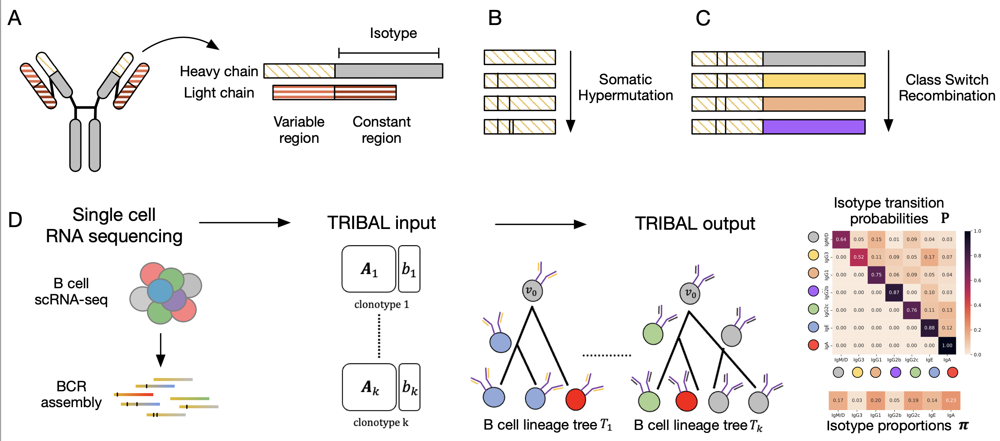

## TRIBAL: Tree inference of B cell clonal lineages 



TRIBAL is a method to infer isotype transition probabilities, isotype proportions and B cell clonal lineages for a set of n B cells clustering into k clonotypes. 


## Contents

- [TRIBAL: Tree inference of B cell clonal lineages](#tribal-tree-inference-of-b-cell-clonal-lineages)
- [Contents](#contents)
- [Installation](#installation)
  - [Using github](#using-github)
- [Phases](#phases)
- [IO Formats](#io-formats)
- [Usage](#usage)
  - [Isotype Transition Probability Inference](#isotype-transition-probability-inference)
  - [B cell lineage tree inference](#b-cell-lineage-tree-inference)
  - [Isotype transition probability inference](#isotype-transition-probability-inference-1)
  - [B cell lineage tree inference](#b-cell-lineage-tree-inference-1)
- [Snakemake](#snakemake)

<a name="install"></a>

## Installation

  
<a name="compilation"></a> 
### Using github
   1. Clone the repository
      ```bash
            $ git clone https://github.com/elkebir-group/tribal.git
       ```
       <a name="pre-requisites"></a> 
   2. Install dependencies 
      + python3 >=3.9
      + [numpy](https://numpy.org/doc/)
      + [ete3](http://etetoolkit.org) >=3.1.2
      + [networkx](https://networkx.org)
      + [pydot](https://pygraphviz.github.io)  
      + [seaborn](https://seaborn.pydata.org)
      + [matplotlib](https://matplotlib.org)
      
      Optional: 
         + [snakemake](https://snakemake.readthedocs.io/en/stable/)
         + [phylip](https://anaconda.org/bioconda/phylip) >3.697
      
      A conda environment named `tribal` with required dependencies can also be created from the provided `tribal_env.yml` files as follows:  
        ``` $ conda env -f tribal_env.yml```
<a name="phases"></a>
## Phases
TRIBAL is run in two phases. 
  1. It infers the isotype transition probabilities for a set of k clonotypes. 
  2. It uses the inferred isotype transition probabilities to aid in B cell lineage tree inference. 


<a name="io"></a>
## IO Formats

 
 See `example/input` for examples of all input files.  


See `example/output` for examples of all output files


1. *Isotype transition probability inference:* 
    + **Input**:  
        - A text file containing a list of clonotype subdirectory names (see example below) which are to be included in the inference
            ```
             clonotype_1
             clontoype_2
             clonotype_3
            ```
        - A text file containing the ordered encoding of isotypes (see example below). The names of isotypes should match the names in the input files.    
             ```
             IgM/D
             IgG3
             IgA
            ```
        - A specified id of the root sequence  
        - Each clonotype subdirectory should contain the following two files:  
            1. fasta file for the concatenated and aligned heavy and light chain variable region sequences  
            2. fasta or csv file with the isotype expression of the heavy chain for each cell (ids should correpond to sequence ids)  
    + **Output**:  
        - a text file containing the inferred isotype transition probabilties   
        - a text file containing the inferred isotype proportions   
        - Optional outputs include heatmaps and state diagrams of the isotype transition probabilities  
2. *Tree inference:* 
    + **Input**:  
        - fasta file for the concatenated and aligned heavy and light chain variable region sequences  
        - a fasta or csv file with the isotype expression of the heavy chain for each cell (ids should correspond to sequence ids)      
        - A text file containing the ordered encoding of isotypes  
        - istoype transition probabilities inferred during the previous phase     
        - tree inference mode (score, refine, search)  
    + **Output**:  
        - a text file containing the tree encoded with each row in the file encoding an edge in the tree as  child, parent    
        - a fasta for csv file containing the inferred sequences of the heavy and light chain   
        - a fasta or csv file containing the inferred isotype states     
        - Optional outputs include png or pdf visualizations of the inferred tree  


 <a name="usage"></a>
## Usage
### Isotype Transition Probability Inference
<a name="probabilities"></a>

        usage: tribal.py [-h] -p PATH [-c CLONOTYPES] [-e ENCODING] [--n_isotypes N_ISOTYPES] [--fasta FASTA] [-i ISOTYPES] [-j JUMP_PROB] [-t TRANSMAT] [-r ROOT] --tree_path TREE_PATH
                        [--candidates CANDIDATES] [--niter NITER] [--thresh THRESH] [--mu MU] [--sigma SIGMA] [--nworkers NWORKERS] [--max_cand MAX_CAND] [-s SEED] [--alpha ALPHA]
                        [--restarts RESTARTS] [--mode {score,refine,search}] [-o OUTPATH] [--score SCORE] [--transmat_infer TRANSMAT_INFER] [--state_probs STATE_PROBS]
                        [--diagram DIAGRAM] [--diagram_pdf DIAGRAM_PDF] [--heatmap HEATMAP] [--save_all_restarts SAVE_ALL_RESTARTS]

        optional arguments:
        -h, --help            show this help message and exit
        -p PATH, --path PATH  path to the directory containing input files
        -c CLONOTYPES, --clonotypes CLONOTYPES
                                filename with list of clonotype subdirectories that should be included in the inference. If not provided, scans provided path for all subdirectory names
        -e ENCODING, --encoding ENCODING
                                text file isotype states listed in germline order
        --n_isotypes N_ISOTYPES
                                the number of isotypes states to use if isotype encoding file is not provided and input isotypes are encoded numerically
        --fasta FASTA         filename of input MSA in fasta file
        -i ISOTYPES, --isotypes ISOTYPES
                                filename of isotype fasta file within each clonotype directory
        -j JUMP_PROB, --jump_prob JUMP_PROB
                                for inititalization of transition matrix if not provided
        -t TRANSMAT, --transmat TRANSMAT
                                optional filename of input transition matrix for initialization
        -r ROOT, --root ROOT  the common id of the root in all clonotypes
        --tree_path TREE_PATH
                                path to directory where candidate trees are saved
        --candidates CANDIDATES
                                filename containing newick strings for candidate trees
        --niter NITER         max number of iterations in the fitting phase
        --thresh THRESH       theshold for convergence in fitting phase
        --mu MU               mean of gaussian white noise to add for distortion
        --sigma SIGMA         std of gaussian white noise to add for distortion
        --nworkers NWORKERS   number of workers to use in the event in multiple restarts
        --max_cand MAX_CAND   max candidate tree size per clonotype
        -s SEED, --seed SEED
        --alpha ALPHA
        --restarts RESTARTS   number of restarts
        --mode {score,refine,search}
        -o OUTPATH, --outpath OUTPATH
                                path to directory where output files should be saved
        --score SCORE         filename where the score file should be saved
        --transmat_infer TRANSMAT_INFER
                                filename where the inferred transition matrix should be saved
        --state_probs STATE_PROBS
                                filename where the inferred state probabilities should be saved
        --diagram DIAGRAM     filename where the png of transition matrix should be saved
        --diagram_pdf DIAGRAM_PDF
                                filename where the pdf of transition matrix should be saved
        --heatmap HEATMAP     filename where the heatmap pdf of transition matrix should be saved
        --save_all_restarts SAVE_ALL_RESTARTS
                                path where all restarts should be saved


### B cell lineage tree inference
<a name="tree"></a>

      usage: tribal_tree.py [-h] [-a ALIGNMENT] [-i ISOTYPES] [-t TRANSMAT] -r ROOT [--timeout TIMEOUT] [-l LINEAGE] [--forest] [--candidates CANDIDATES]
                            [--mode {score,refine,search}] -e ENCODING [--alpha ALPHA] [-j JUMP_PROB] [--ntrees NTREES] [-o OUTPUT] [--tree TREE] [--fasta FASTA] [--png PNG]
                            [--all_pngs] [--sequences SEQUENCES] [--score SCORE] [--iso_infer ISO_INFER] [--save_candidates SAVE_CANDIDATES] [--nworkers NWORKERS] [--seed SEED]

      optional arguments:
        -h, --help            show this help message and exit
        -a ALIGNMENT, --alignment ALIGNMENT
                              filename of input fasta file containing the alignment
        -i ISOTYPES, --isotypes ISOTYPES
                              filename of input file containing the isotype labels
        -t TRANSMAT, --transmat TRANSMAT
                              filename of input transition matrix
        -r ROOT, --root ROOT  the id of the root sequence in the alignment
        --timeout TIMEOUT     max number of hours to let tribal search per tree
        -l LINEAGE, --lineage LINEAGE
                              pickle file of lineage tree/forest returned from tribal.py
        --forest
        --candidates CANDIDATES
                              filename containing newick strings for candidate tree(s)
        --mode {score,refine,search}
        -e ENCODING, --encoding ENCODING
        --alpha ALPHA
        -j JUMP_PROB, --jump-prob JUMP_PROB
        --ntrees NTREES       number of top scoring trees to return
        -o OUTPUT, --output OUTPUT
                              outputfile of all best trees
        --tree TREE           outputfile of best tree
        --fasta FASTA         filename where reconstructed ancestral sequences should be saved as fasta file
        --png PNG             filename where to save a png of the optimal tree
        --all_pngs
        --sequences SEQUENCES
                              filename where reconstructed ancestral sequences should be saved as csv file
        --score SCORE         filename of the objective function value objective function value
        --iso_infer ISO_INFER
                              filename of the inferred isotypes for the internal nodes
        --save_candidates SAVE_CANDIDATES
                              directory where to save data for candidate trees
        --nworkers NWORKERS   number of workers to use in the event of multiple input candidate trees
        --seed SEED           random seed for picking a single best tree among all tied trees


### Isotype transition probability inference


Here we show an example of how to run `TRIBAL` to infer isotype transition probabilities. We will use experimental dataset GCB_NP_2.  To run TRIBAL for different datasets, replace `GCB_NP_2` with either `day_14` or `GCB_NP_1`.
The input files are located in the `experimental_data/GCB_NP_2`:


    $   python src/tribal.py -c experimental_data/GCB_NP_2/clonotypes.txt \
        -p experimental_data/GCB_NP_2/input \
        -r naive \
        -e experimental_data/mouse_isotype_encoding.txt \
        --tree_path experimental_data/GCB_NP_2/dnapars \
        --alpha 0.75 --niter 10  --thresh 0.1  \
         -j 0.25 --mu 0.075 --sigma 0.05 \
        --nworkers 5 --restarts 5 \
        --transmat_infer experimental_data/GCB_NP_2/transmat.txt  \
        --state_probs experimental_data/GCB_NP_2/proportions.txt \
        --heatmap experimental_data/GCB_NP_2/transmat.png  \
        --propmap experimental_data/GCB_NP_2/proportions.png 

### B cell lineage tree inference

Here we show an example of how to run `TRIBAL` to infer a B cell lineage tree for `B_12_1_5_24_1_5` for experimental data `GCB_NP_2`. The input files are located in the `experimental_data/GCB_NP_2/B_12_1_5_24_1_5`. First, we narrow down candidate trees to the top 10 by ranking them after tree refinment.

    $   python src/tribal_tree.py \
        -r naive \
        -a experimental_data/GCB_NP_2/input/B_12_1_5_24_1_5/concat.aln.fasta \
       -t experimental_data/GCB_NP_2/transmat.txt \
       -e experimental_data/mouse_isotype_encoding.txt \
       -i experimental_data/GCB_NP_2/B_12_1_5_24_1_5/isotype.fasta \
       --candidates experimental_data/GCB_NP_2/dnapars/B_12_1_5_24_1_5/outtree \
       --alpha 0.75 \
       --mode refine \
        --ntrees 10 \
       --nworkers 5 \
       -o experimental_data/GCB_NP_2/example/forest.pickle

Then, we perform a greedy hill climbing search starting from each of the top canidates using an isotype aware SPR tree move.

    $   python src/tribal_tree.py \
        -r naive \
        -a experimental_data/GCB_NP_2/input/B_12_1_5_24_1_5/concat.aln.fasta \
       -t experimental_data/GCB_NP_2/transmat.txt \
       -e experimental_data/mouse_isotype_encoding.txt \
       -i experimental_data/GCB_NP_2/B_12_1_5_24_1_5/isotype.fasta \
       -l experimental_data/GCB_NP_2/example/forest.pickle
       --forest 
       --alpha 0.75 \
       --fasta experimental_data/GCB_NP_2/example/seq.fasta \
       --score experimental_data/GCB_NP_2/example/score.csv \
       --iso_infer experimental_data/GCB_NP_2/example/isotypes.csv \
       --png experimental_data/GCB_NP_2/example/tree.png \
       --mode search \
       --nworkers 5 \
       --tree experimental_data/GCB_NP_2/example/tree.txt 

## Snakemake 
To simplify the process of inference, we have provided  `experimental_data/Snakefile` and `experimental_data/config.yaml` files. To run the snakemake pipeline, navigate to the `experimental_data` directory.  
     ```$   cd experimental_data```

Update the `config.yaml` file with the desired dataset and TRIBAL parameters. Then use the following 
command to execute the pipeline, where the argument `-j` specifies the number of cores.   
     ```$   snakemake -j 10```

