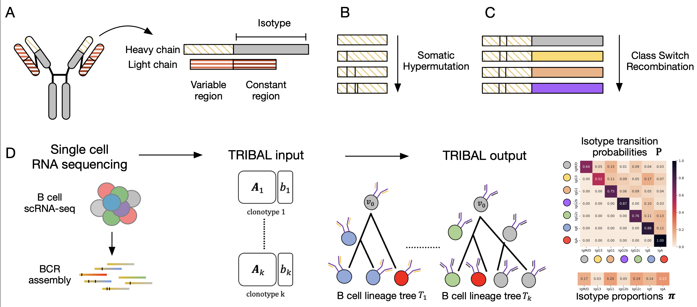

## TRIBAL: Tree inference of B cell clonal lineages 



TRIBAL is a method to infer B cell clonal lineages and isotype transition probabilities for a set of n B cells clustered into k clonotypes. 


## Contents
- [Installation](#installation)
  - [Using github](#using-github)
- [Phases](#phases)
- [IO Formats](#io-formats)
- [Usage](#usage)
  - [Isotype Transition Probability Inference](#isotype-transition-probability-inference)
  - [B cell lineage Tree Inference](#b-cell-lineage-tree-inference)
  - [Example](#example)


<a name="install"></a>

## Installation

  
<a name="compilation"></a> 
### Using github
   1. Clone the repository
      ```bash
            $ git clone https://github.com/elkebir-group/TRIBAL.git
       ```
       <a name="pre-requisites"></a> 
   2. Install dependencies 
      + python3 >=3.9
      + [numpy](https://numpy.org/doc/)
      + [pandas](https://pandas.pydata.org)
      + [ete3](http://etetoolkit.org) >=3.1.2
      + [networkx](https://networkx.org)
      + [pygraphviz](https://pygraphviz.github.io)  
      + [seaborn](https://seaborn.pydata.org)
      + [matplotlib](https://matplotlib.org)
      + [gurobipy](https://pypi.org/project/gurobipy/) ( **Requires the activation of a license, which is free for academic use.**)
      
      Optional: 
         + [snakemake](https://snakemake.readthedocs.io/en/stable/)
      

<a name="phases"></a>
## Phases
TRIBAL is run in two phases:
  1. infers the isotype transition probabilities for a set of $k$ clonotypes. 
  2. finds the most parsimonious refinement $T'_j$  of each input tree $T_j$ for every clonotype $j$.

Two phases are required because the size of the input sets may be large for some clonotypes. TRIBAL will 
downsample the input set in each iteration to size `--max_cand` to speed up inference. It always retains the best tree found so far in its sample
to ensure convergence of the coordinate ascent approach. 
  In the second phase, TRIBAL solves the most parsiminonious refinement for every
input tree given the isotype transition probabilities inferred in phase $1$.  

 In addition, we provide a helper script [prep_parsimony_format.py](src/prep_parsimony_forest.py) that converts the input trees $\mathcal{T}_j$ (obtained via dnapars), the sequences $\mathbf{A}_j$ and isotype $\mathbf{b}_j$ for each clonotype $j$ of the $k$ clonotypes to the input format for TRIBAL.  


<a name="io"></a>
## IO Formats


1. Input

    - A text file containing a list of clonotype subdirectory names that are to be included in the inference (see example below) or see [clonotypes.txt](NP-KLH/NP-KLH-2b/clonotypes.txt)
        ```
          clonotype_1
          clontoype_2
          clonotype_3
        ```
    - A text file containing the ordered list of isotypes found in the data. These will be encoded from $0$ to $r-1$, where $r$ is the number of isotypes listed in the file (see example below). As naming conventions of isotype states varies, the listed isotypes must match the isotype names in the input files.  See example below or see [isotype_encoding.txt](NP-KLH/isotype_encoding.txt).
        ```
        IgM/D
        IgG3
        IgA
      ```
    - A specified id of the id of the naive BCR 
    - `outtree` file generated by dnapars containing the Newick string of each input tree. See [outtree](NP-KLH/NP-KLH-2b/dnapars/B_19_4_56_2_1_52/outtree) for an example.
      **Note: we are currently working to integrate this step within our package.**
    - Each clonotype subdirectory, e.g.,  [B_19_4_56_2_1_52](NP-KLH/NP-KLH-2b/input/B_19_4_56_2_1_52) should contain the following two files:  
        1. fasta file for the MSA of the  heavy and/or light chain variable region sequences. See 
        [heavy.aln.fasta](NP-KLH/NP-KLH-2b/input/B_19_4_56_2_1_52/heavy.aln.fasta) for an example.
        2. fasta or csv file with the isotype expression of the heavy chain for each cell (ids should correspond to sequence ids). See  [isotype.fasta](NP-KLH/NP-KLH-2b/input/B_19_4_56_2_1_52/isotype.fasta) for an example.
  2. Outputs   
  + **isotype transition probability inference**:  
      - a text file containing the inferred isotype transition probabilties
      - Optional output includes a heatmap of the inferred isotype transition probabilites
  + **B cell lineage inference**:  

      - a text file containing the tree encoded with each row in the file encoding an edge in the tree as  child, parent     
      - a fasta or csv file containing the inferred isotype states     
      - Optional outputs include png or pdf visualizations of the inferred tree, a pickle file containing all optimal solutions


 <a name="usage"></a>
## Usage
### Isotype Transition Probability Inference
<a name="probabilities"></a>
```

usage: tribal.py [-h] [-f FOREST] [-p PATH] [-c CLONOTYPES] [-e ENCODING] [--n_isotypes N_ISOTYPES] [--fasta FASTA] [-i ISOTYPES] [-j JUMP_PROB] [-t TRANSMAT]
                 [-r ROOT] [--tree_path TREE_PATH] [--candidates CANDIDATES] [--niter NITER] [--thresh THRESH] [--nworkers NWORKERS] [--max_cand MAX_CAND] [-s SEED]
                 [--restarts RESTARTS] [--mode {score,refine,refine_ilp,search}] [--score SCORE] [--transmat_infer TRANSMAT_INFER] [--state_probs STATE_PROBS]
                 [--heatmap HEATMAP] [--propmap PROPMAP]

optional arguments:
    -h, --help            show this help message and exit
    -f FOREST, --forest FOREST
                          path to pickled clonotypes dictionary of lineage forests
    -p PATH, --path PATH  path to the directory containing input files
    -c CLONOTYPES, --clonotypes CLONOTYPES
                          filename with list of clonotype subdirectories that should be included in the inference. If not provided, scans provided path for all
                          subdirectory names
    -e ENCODING, --encoding ENCODING
                          text file isotype states listed in germline order
    --n_isotypes N_ISOTYPES
                          the number of isotypes states to use if isotype encoding file is not provided and input isotypes are encoded numerically
    --fasta FASTA         filename of input MSA in fasta file
    -i ISOTYPES, --isotypes ISOTYPES
                          filename of isotype fasta file within each clonotype directory
    -j JUMP_PROB, --jump_prob JUMP_PROB
                          for inititalization of transition matrix if not provided
    -t TRANSMAT, --transmat TRANSMAT
                          optional filename of input transition matrix for initialization
    -r ROOT, --root ROOT  the common id of the root in all clonotypes
    --tree_path TREE_PATH
                          path to directory where candidate trees are saved
    --candidates CANDIDATES
                          filename containing newick strings for candidate trees
    --niter NITER         max number of iterations in the fitting phase
    --thresh THRESH       theshold for convergence in fitting phase
    --nworkers NWORKERS   number of workers to use in the event in multiple restarts
    --max_cand MAX_CAND   max candidate tree size per clonotype
    -s SEED, --seed SEED
    --restarts RESTARTS   number of restarts
    --mode {score,refine,refine_ilp,search}
    --score SCORE         filename where the score file should be saved
    --transmat_infer TRANSMAT_INFER
                          filename where the inferred transition matrix should be saved
    --state_probs STATE_PROBS
                          filename where the inferred state probabilities should be saved
    --heatmap HEATMAP     filename where the {png,pdf} of transition matrix should be saved
    --propmap PROPMAP     filename where the {pdf,png} of isotype proportions should be saved

```


### B cell lineage tree inference
<a name="tree"></a>
```

usage: tribal_tree.py [-h] [-f INPUT_FOREST] [-c CLONOTYPE] [-a ALIGNMENT] [-i ISOTYPES] [-t TRANSMAT] -r ROOT
                      [--timeout TIMEOUT] [-l LINEAGE] [--forest] [--candidates CANDIDATES]
                      [--mode {score,refine,refine_ilp,search}] -e ENCODING [--tree TREE] [--fasta FASTA] [--png PNG]
                      [--sequences SEQUENCES] [--score SCORE] [--reversible] [--iso_infer ISO_INFER]
                      [--all_optimal_sol ALL_OPTIMAL_SOL] [--nworkers NWORKERS] [--pickle_best PICKLE_BEST]
                      [--pickle_all PICKLE_ALL]

optional arguments:
  -h, --help            show this help message and exit
  -f INPUT_FOREST, --input-forest INPUT_FOREST
                        path to pickled clonotypes dictionary of lineeage forests
  -c CLONOTYPE, --clonotype CLONOTYPE
                        name of clonotype lineage to refine from the full forest
  -a ALIGNMENT, --alignment ALIGNMENT
                        filename of input fasta file containing the alignment
  -i ISOTYPES, --isotypes ISOTYPES
                        filename of input file containing the isotype labels
  -t TRANSMAT, --transmat TRANSMAT
                        filename of input transition matrix
  -r ROOT, --root ROOT  the id of the root sequence in the alignment
  --timeout TIMEOUT     max number of hours to let tribal search per tree
  -l LINEAGE, --lineage LINEAGE
                        pickle file of lineage tree/forest returned from tribal.py
  --forest
  --candidates CANDIDATES
                        filename containing newick strings for candidate tree(s)
  --mode {score,refine,refine_ilp,search}
  -e ENCODING, --encoding ENCODING
  --tree TREE           outputfile of best tree
  --fasta FASTA         filename where reconstructed ancestral sequences should be saved as fasta file
  --png PNG             filename where to save a png of the optimal tree
  --sequences SEQUENCES
                        filename where reconstructed ancestral sequences should be saved as csv file
  --score SCORE         filename of the objective function value objective function value
  --reversible          a flag to indicate the standard 0/1 cost function is used (the number of isotype changes is minimized
                        and irreversiblility is ignored)
  --iso_infer ISO_INFER
                        filename of the inferred isotypes for the internal nodes
  --all_optimal_sol ALL_OPTIMAL_SOL
                        path where all optimal solution results are saved
  --nworkers NWORKERS   number of workers to use in the event of multiple input candidate trees
  --pickle_best PICKLE_BEST
                        filename to pickle the best results
  --pickle_all PICKLE_ALL
                        filename to pickle the best results

```

### Example
<a name="example"></a>


We will use the [NP-KLH-2b](NP-KLH-2b) as an example to demonstrate the usage of TRIBAL. First, navigate to the [NP-KLH](NP-KLH) directory via the command line:

```
cd NP-KLH
```


Next, we prep the dnapars output, sequences and isotypes for TRIBAL. 

```

  python ../src/prep_parismony_forest 
    --clonotypes NP-KLH-2b/clonotypes.txt
    --encoding isotype_encoding.txt 
    -p NP-KLH-2b/input --tree_path ./NP-KLH-2b  -r naive 
    --fasta heavy.aln.fasta 
    -o NP-KLH-2b/input.pickle 

```

Then, we infer isotype transition probabilities with downsampling (`--max_cand 10`).  

```
  python ../src/tribal.py --forest NP-KLH-2b/input.pickle 
    -r naive --encoding isotype_encoding --seed 3 
    --niter 10 --restarts 1 --mode refine_ilp 
    --thresh 0.1 --nworkers 1 --max_cand 10
    --transmat_infer NP-KLH-2b/trans_probs.txt
    --heatmap NP-KLH-2b/trans_probs.png
    
```
Notes:

- Parallelization can be applied by increasing `--nworkers`. 
- Setting `--mode score` means that a weighted Sankoff to infer the isotype labels $\beta'$ instead of finding the most parsimonious refinement (solving the MPTR problem). 

Finally, we use the inferred isotype transition probabilities to infer a B cell lineage tree $T'$ labeled by isotypes $\beta'$ for clonotype  [B_19_4_56_2_1_52](NP-KLH/NP-KLH-2b/B_19_4_56_2_1_52).


```

   python ../../src/tribal_tree.py 
    -r naive -f NP-KLH-2b/input.pickle
    -c B_19_4_56_2_1_52
    -t NP-KLH-2b/trans_probs.txt
    -e isotype_encoding.txt 
    --mode refine_ilp
    --nworkers 1
    --score NP-KLH-2b/csr_likelihoods.csv
    --tree NP-KLH-2b/example.tree
    --iso_infer NP-KLH-2b/example.isotypes
    --png NP-KLH-2b/example.png


```

We provide a [Snakefile](NP-KLH/Snakefile) and associated [config file](NP-KLH/config.yml) that can be used to run this pipeline for all NP-KLH datasets and clonotypes, using the following command:

```
snakemake -j 10
```

Similarily, a [Snakefile](ABC/Snakefile) and associated [config file](ABC/config.yml) is provided to run TRIBAL for the ABC data. 
