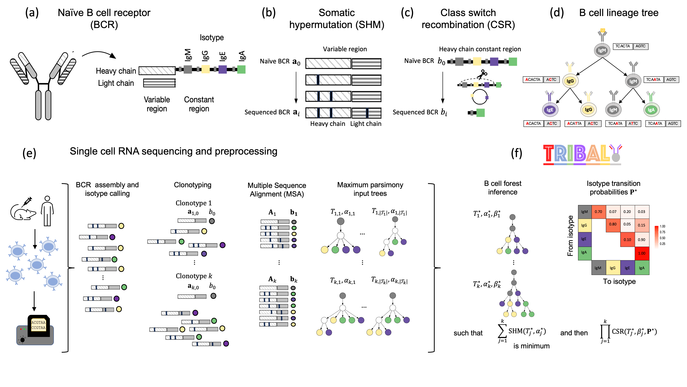

TRIBAL
-------------------------------------------------------------------------------

TRIBAL (TRee Inference of B cell clonAl Lineages) is a method to infer B cell lineage trees from single-cell RNA sequencing data. TRIBAL trees jointly model the evolutionary 
processes of somatic hypermutation and class switch recombination. 

The input to TRIBAL is a multiple sequence alignment for each of the predetermined clonotypes aligned to the germline sequence and the isotype of each sequenced B cell. 
The output is a B cell lineage tree with nodes labeled by BCR sequences (concatenated heavy and light chain) and the isotype of each B cell. 

Contact
-------------------------------------------------------------------------------

For help and questions please contact the [El-Kebir Lab](mailto:melkebir@illinois.eu).

## Dependencies

**Depends:** dnapars, mafft  
**Imports:** networkx, pyomo, numpy, scipy, pandas, ete3  
**Suggests:** pygrahviz  

## Authors

[Leah L. Weber](mailto:leahlw2@illinois.edu)  
[Derek Reiman](mailto:dreiman@ttic.edu)  
[Mrinomy S. Roddur ](mailto:mroddur2@illinois.edu)  
[Yuanyuan Qi](mailto:yq7@illinois.edu)   
[Mohammed El-Kebir](mailto:melkebir@illinois.edu)  
[Aly A. Khan](mailto:aakhan@uchicago.edu)  

## Citing

To cite TRIBAL in publications, please use

Weber, L. L., Reiman, D., Roddur, M. S., Qi, Y., El-Kebir, M., & Khan, A. A. TRIBAL: Tree Inference of B cell Clonal Lineages. bioRxiv. [doi.org/10.1101/2023.11.27.568874](https://doi.org/10.1101/2023.11.27.568874).

## License

BSD-3